# OWASP Juice Shop Security Assessment
Security assessment of OWASP Juice Shop using Burp Suite. Demonstrates identification, exploitation, and documentation of common web application vulnerabilities.

OWASP Juice Shop Security Assessment
Overview

This project documents a web application security assessment performed against OWASP Juice Shop using Burp Suite and Firefox. The goal was to identify, analyze, and document common web application vulnerabilities in a controlled learning environment.

- Objectives
  - Intercept and analyze HTTP requests
  - Identify security vulnerabilities
  - Understand common web application attack vectors
  - Document findings and remediation recommendations
  - Practice web application security testing techniques

- Environment
  - OWASP Juice Shop
  - Burp Suite Community Edition
  - Firefox
  - exiftool
  - docker
  - Kali Linux

- Vulnerabilities Assessed:
  
  - Miscellaneous
 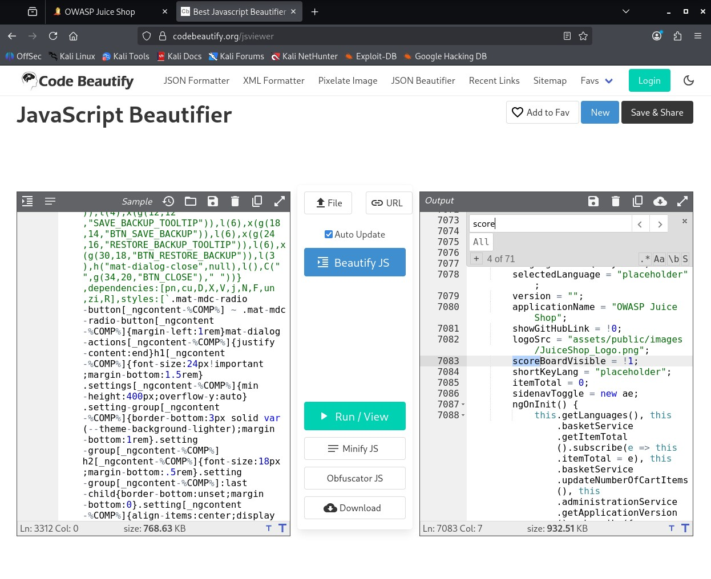
 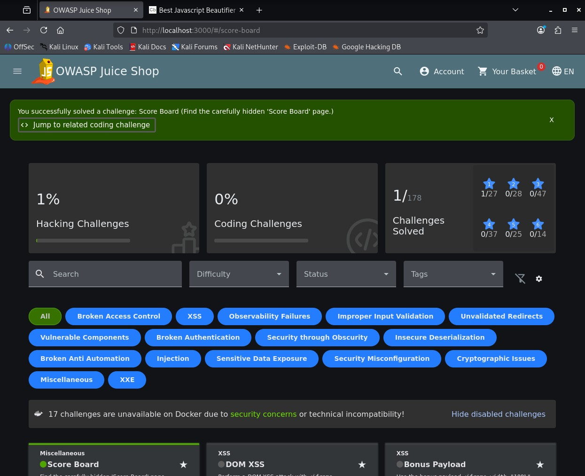

  - Security Misconfiguration
 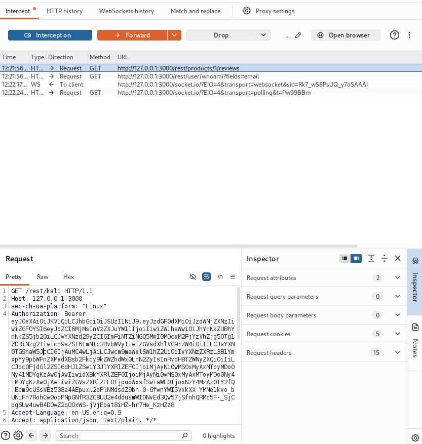
 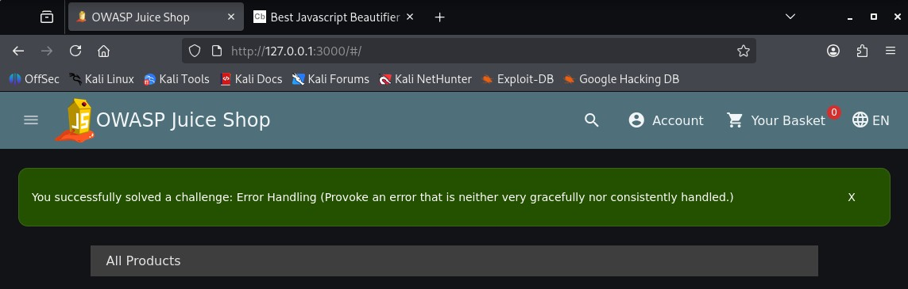

  - Improper Input Validation
 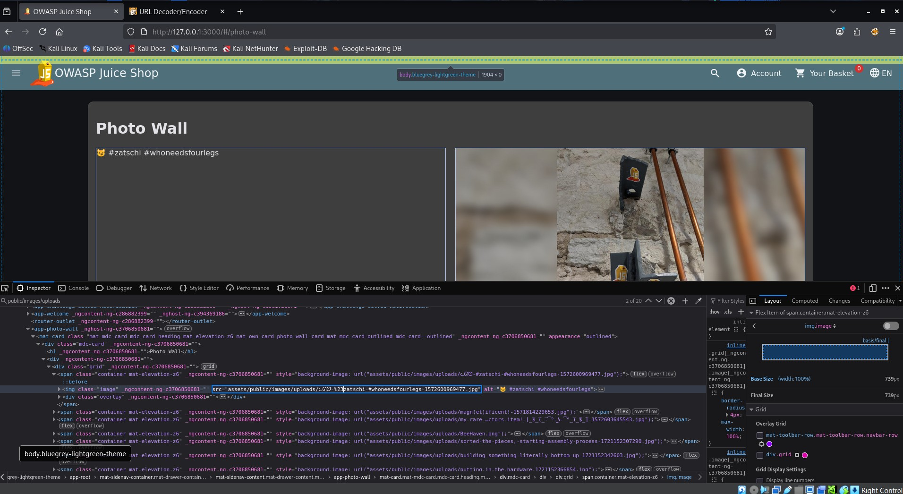
 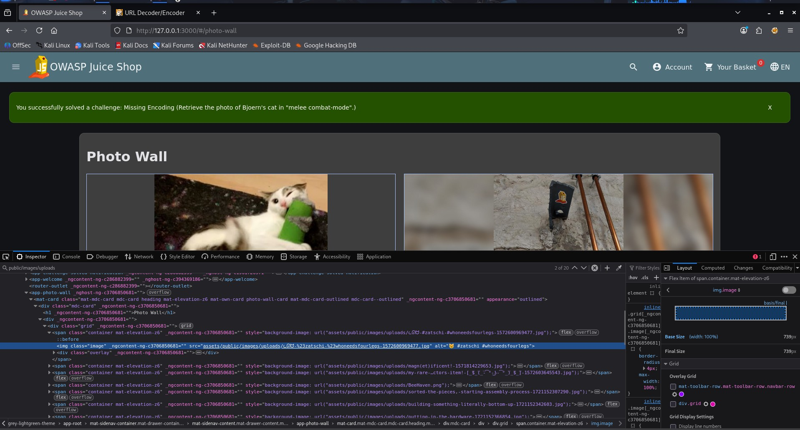
 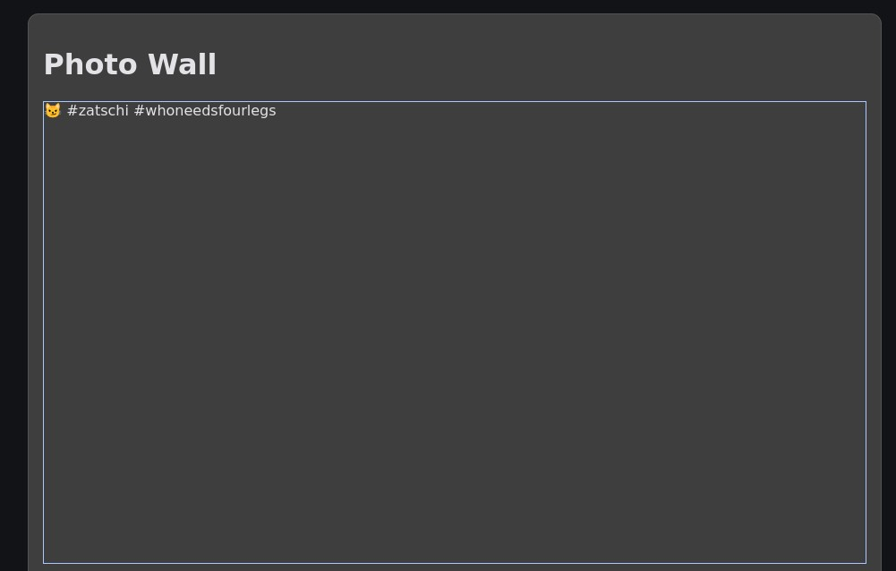

 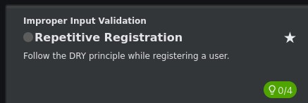
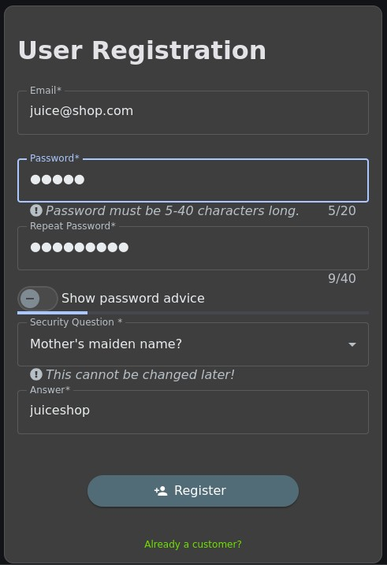

  - SQL Injection
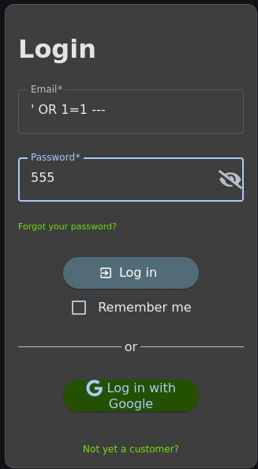
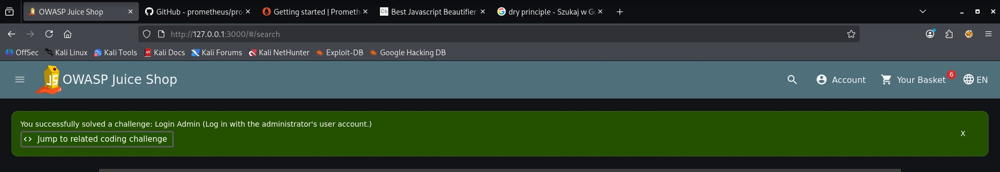
    
  - Cross-Site Scripting (XSS)
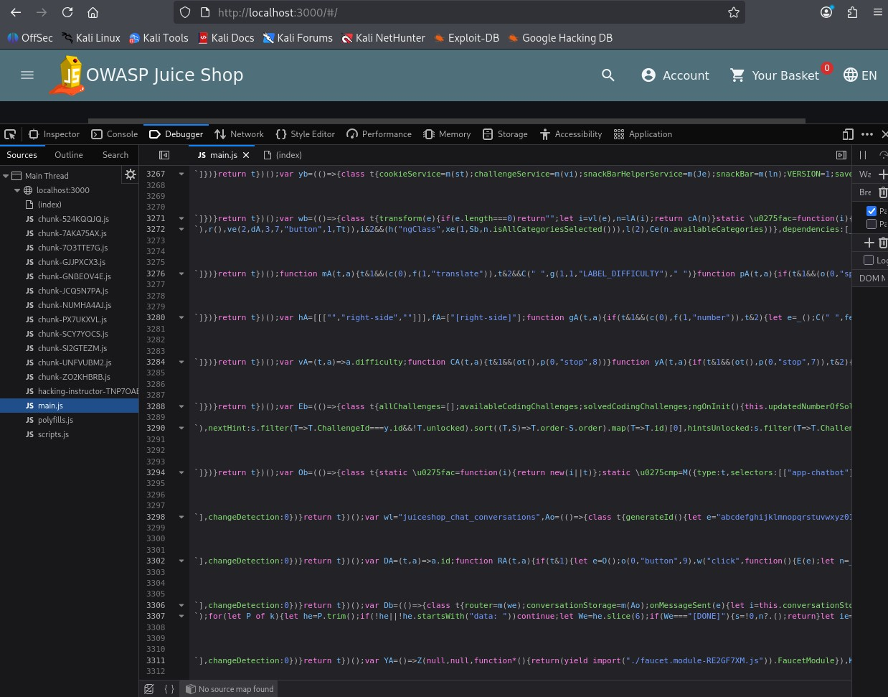
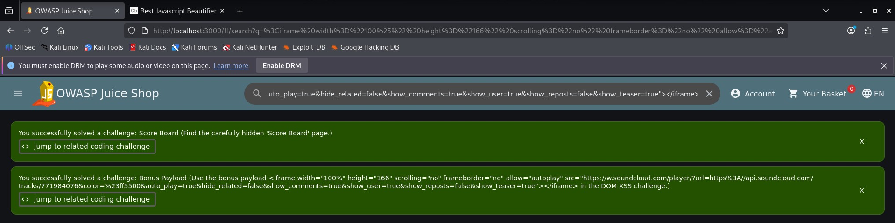

  - Observability Failures
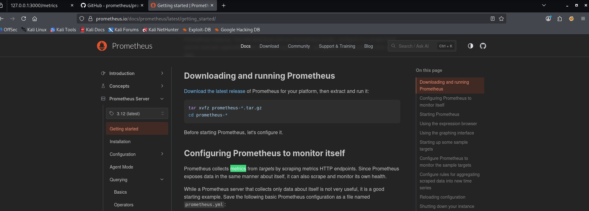
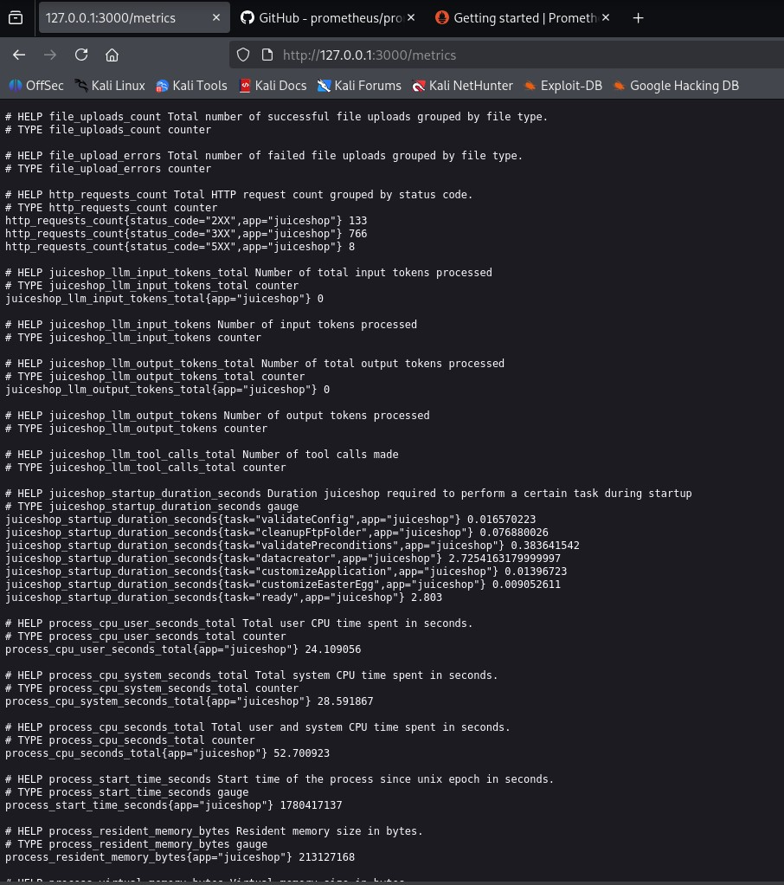

  - Broken Access Control
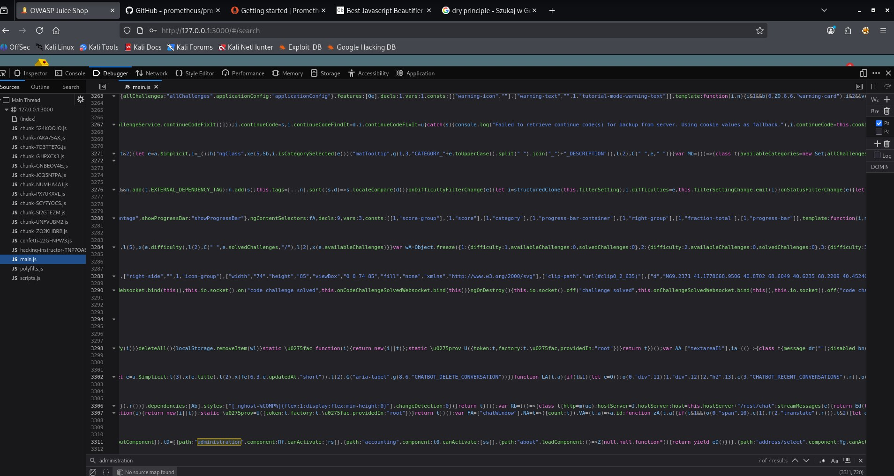
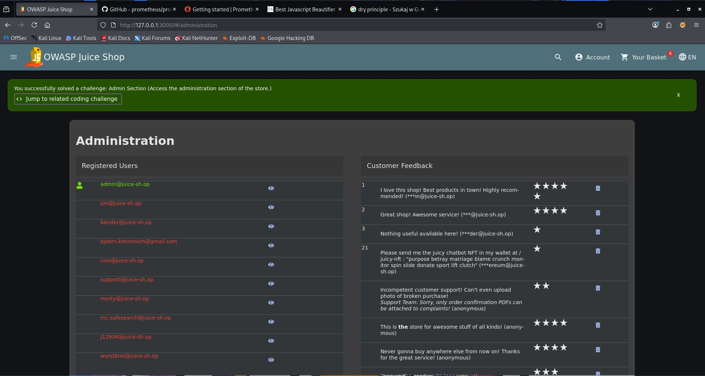

  - Sensitive Data Exposure
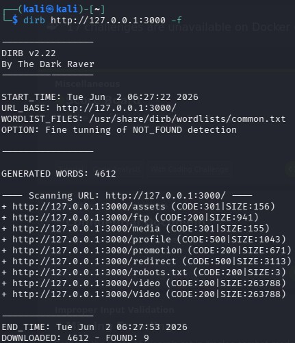
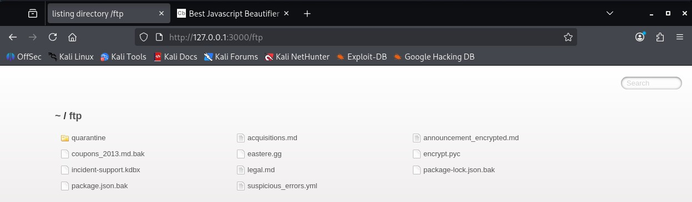
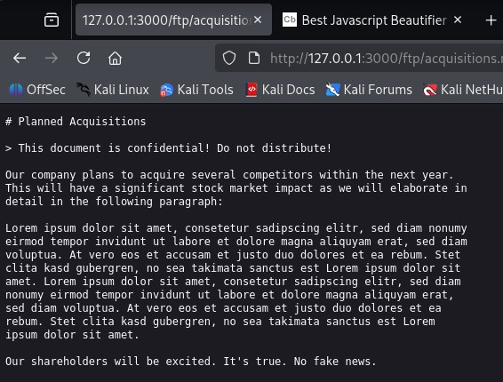

- Methodology
  - Install Foxy Proxy and certificates.
  - Configured browser proxy through Burp Suite.
  - Intercepted and analyzed application traffic.
  - Tested application functionality for security weaknesses.
  - Documented identified vulnerabilities.
  - Provided remediation recommendations.

- Repository Structure
/findings – Detailed vulnerability reports
/screenshots – Evidence and screenshots
/report – Security assessment report

- Skills Demonstrated
  - Web Application Security Testing
  - Burp Suite
  - HTTP Request Analysis
  - Vulnerability Assessment
  - Security Documentation
  - Security Reporting
  - Disclaimer

This project was conducted in a legal training environment using OWASP Juice Shop, an intentionally vulnerable application designed for security education and testing.
